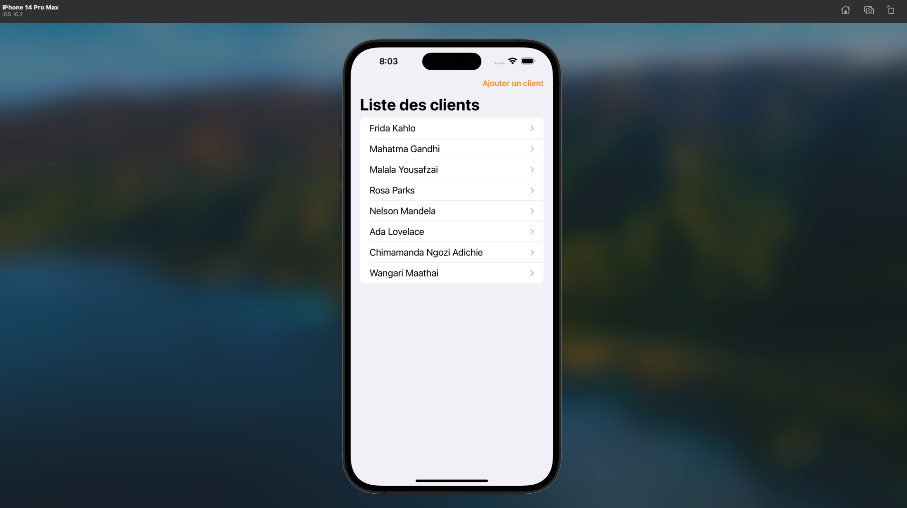
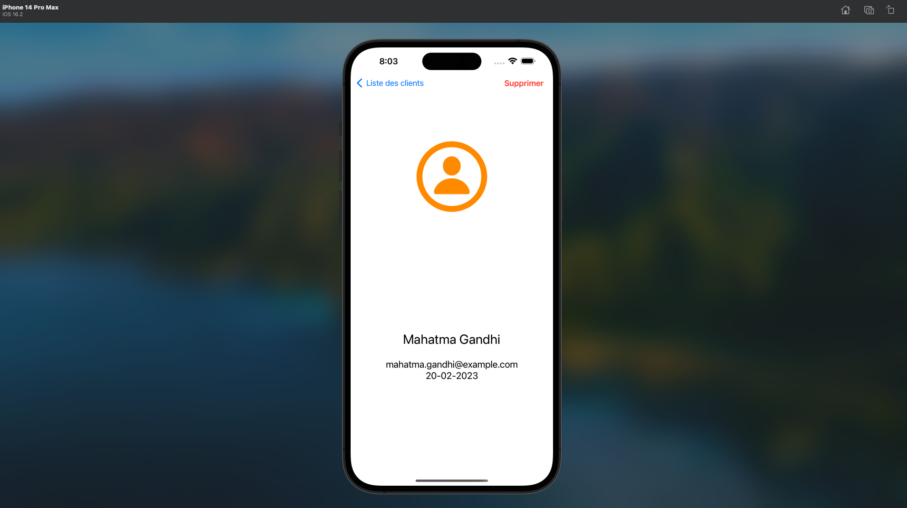

# P13-1_DA-iOS

## Testez une application iOS

Description

Le projet "Testez une application iOS" vous permettra de développer une solide expertise dans le développement d’applications iOS, avec un accent particulier sur les tests unitaires.

Ce projet s'articule autour de trois grandes activités :

- Apprentissage des bases des tests iOS : Débogage, tests unitaires, et Behaviour Driven Development (BDD).
- Réalisation de tests unitaires : Tester les fonctionnalités d’une application iOS existante pour garantir sa fiabilité.
- Refactoring de l’application : Améliorer la qualité du code existant tout en conservant son comportement initial.

## Objectifs

- Maîtriser les tests unitaires : Comprendre leur rôle et leur importance dans le cycle de développement.
- Appliquer le Behaviour Driven Development (BDD) : Développer des fonctionnalités robustes basées sur des spécifications claires.
- Refactoriser un projet iOS : Améliorer le code en le rendant lisible, maintenable, et évolutif.

##Activités principales

1.Cours sur les tests iOS
- Apprenez les bases du débogage et des tests d'applications iOS.
- Familiarisez-vous avec les tests unitaires et le concept de BDD.

2.Écriture de tests unitaires
- Analysez les fonctionnalités existantes de l’application.
- Écrivez des tests unitaires pour valider le bon fonctionnement de chaque fonctionnalité.

3.Refactoring de l’application
- Réorganisez le code pour le rendre plus lisible, maintenable et évolutif.
- Améliorez les performances et la qualité globale de l’application.

##Compétences développées

- Mise en œuvre des tests unitaires pour assurer la qualité du code.
- Utilisation des outils de débogage et des frameworks de tests pour iOS.
- Application de bonnes pratiques de développement et de refactoring.
- Renforcement des connaissances en Swift, Xcode, et SwiftUI.

## Screenshots

| 

 | 

 | 

 |
|:--:|:--:|:--:|
| **Home** | **Details** | **Search** |

- **Screenshot 1**: Display the article list screen where users can browse through the available articles.
  
- **Screenshot 2**: Show the article details screen, including descriptions, images, and relevant information about each article, once the user has selected an article.

- **Screenshot 3**: Present the article search screen, where users can input search criteria such as keywords, categories, and filters to find specific articles.

These can help illustrate the user flow and functionality visually.

## Demo Video

## Technologies Used

- **Swift**
- **SwiftUI**
- **Xcode**

## Installation

1. Clone this GitHub repository to your local machine.
2. Open the project in Xcode.
3. Install the necessary dependencies by running the command `pod install` in your terminal.
4. Launch the application on your simulator or connected iOS device.

## Contribution

Contributions are welcome! If you would like to contribute to this project, please follow these steps:

1. Fork this GitHub repository.
2. Create a new branch for your feature: `git checkout -b feature/your-feature-name`.
3. Make your modifications and improve the code.
4. Commit your changes: `git commit -m 'Add a new feature'`.
5. Push your changes to your fork: `git push origin feature/your-feature-name`.
6. Open a pull request to propose your changes.

